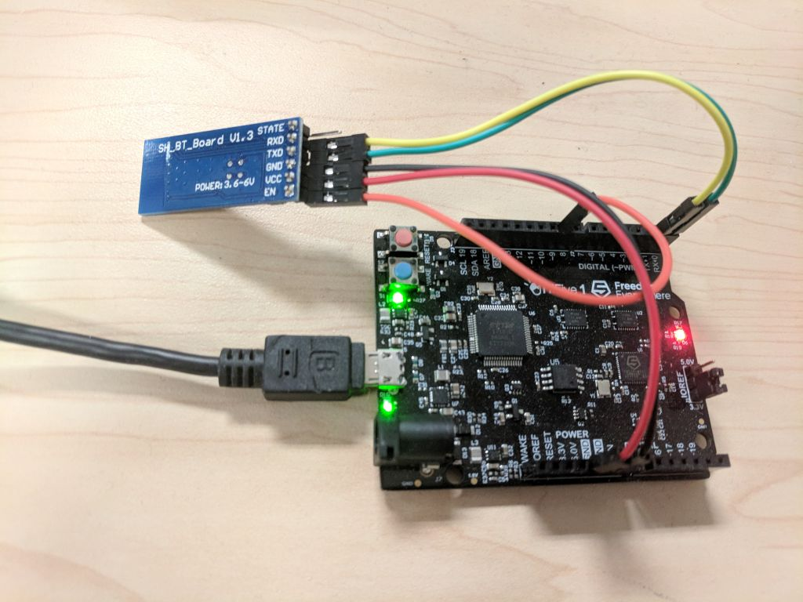

# Gas Pump Skimmer Scanner

In September 2017, Nathan Seidle at Sparkfun published a [great deep-dive article](https://learn.sparkfun.com/tutorials/gas-pump-skimmers) exploring how certain HC-05 Bluetooth gas pump skimmers worked. This project is inspired by that article, and demonstrates a fully-functioning Arduino-based skimmer scanner, using a HC-05 module connected via UART.

Keep in mind that this is by no means an exhaustive or reliable method of detecting all skimmers, and that even under good conditions, skimmers that meet the criteria may sometimes fail to be detected. In other words, we assume no liability for anything that may result from the use of this project.

## Requirements
* [HiFive1](https://www.sifive.com/products/hifive1/) - A RISC-V, Arduino-compatible development board.
* [HC-05 Bluetooth Module](https://www.amazon.com/gp/product/B01G9KSAF6/) - Any HC-05 BT module should be okay, as long as it has an EN pin. HC-06 modules will not work because they can only run in slave mode.
* [Arduino IDE](https://www.arduino.cc/en/Main/Software)
* Optional: a second set of the HiFive1 board and HC-05 module, to run as a skimmer emulator. Alternatively, run the [Sparkfun skimmer scanner app](https://play.google.com/store/apps/details?id=skimmerscammer.skimmerscammer) to test that the skimmer emulator works.

## Getting Started
Install and configure the Arduino IDE. Follow the instructions in the [HiFive1 Getting Started Guide](https://www.sifive.com/documentation/boards/hifive1/hifive1-getting-started-guide/) to add the SiFive boards to the Boards Manager. As of this writing, there is no native library support yet for Arduino IDE for Windows, although it may be possible to manually add the toolchain.

Wire the HC-05 to the HiFive:

| HiFive1 | HC-05 Pin |
| --- | --- |
| 5.0V | VCC |
| GND | GND |
| GPIO 0 (RX) | TX |
| GPIO 1 (TX) | RX |
| GPIO 9 | EN |

Note: The last pin, GPIO 9, can be changed by modifying `HC05_PIN_EN` in the source code.

Make sure the correct board, port, and programmer are configured in the IDE, then simply compile and upload the sketch.

Command and response output can be seen in the Arduino IDE's serial monitor, or by connecting to serial with 8n1 at 38400bps.

Depending on how many Bluetooth devices are analyzed, the onboard LED should start blinking rapidly after about 20-30 seconds, with green signifying "no skimmer detected" and red as "potential skimmer detected". After 10 seconds of blinking, it will start scanning again.

# Configuration
Several constants are defined at the top of the source file via `#define` directives:
* `DEBUG_OUTPUT` (default: `1`): Whether or not to print out HC-05 device responses. This has its own set of implications, explained below.
* `EMULATION_MODE` (default: `0`): Whether to act as a scanner (`0`) or a skimmer emulator (`1`). Since we cannot legally obtain and use a real skimmer for testing, emulating skimmer responses is the next-best thing. Ideally, to see this project in action, have two boards set up, with one acting as a skimmer emulator and one as a scanner.
* `HC05_PIN_EN` (default: `9`): The GPIO pin on the HiFive1 wired to the EN pin on the HC-05.
* `HC05_BAUD` (default: `38400`): Baud rate for serial connection
* `MAX_DEVICES` (default `5`): Maximum number of devices to scan for, per run.
* `RESPONSE_BUFFER_SIZE` (default `256`): Buffer size, in bytes, for temporarily storing device response. Generally this can be left untouched.
* `COMMAND_TIMEOUT` (default `6`): Timeout, in seconds, to wait for after issuing an AT command. Generally this can be left untouched.

# How It Works
According to the [Sparkfun article](https://learn.sparkfun.com/tutorials/gas-pump-skimmers), certain types of skimmers that use HC-05 modules are left at default settings. This means that they:
* Are running in slave mode
* Advertise `HC-05` as their device name
* Have a default password of `1234`
* Respond deterministically to certain commands:
  * When receiving `?`, they send back `1`
  * When receiving `P`, they send back `M`

Therefore, any Bluetooth device that meets these criteria may very likely be a skimmer. There are certainly skimmers out there that fall outside these conditions, and there are even skimmers that may meet these conditions but may not get detected (e.g. due to bad signal or interference).

Nonetheless, to test for these conditions, simply connect a HC-05 device to the HiFive1, set it to master mode, then send [AT commands](https://www.itead.cc/wiki/Serial_Port_Bluetooth_Module_%28Master%2FSlave%29_%3A_HC-05) to have it probe for devices, query device names, attempt to connect to suspicious devices, and test for command responses.

# The Serial.print() Problem
The HiFive1 board currently only implements one UART port (UART0). The signals are shared with both GPIO pins 0/1, and with the FTDI chip. Practically, what this means that if a serial port is opened with `Serial.begin()` as an output console, the signal will also be echoed to and from GPIO pins 0 and 1. While this means that commands such as `AT+RESET` can be sent to (and its response received from) a HC-05 device connected to these pins, it also means any print statements such as "Hello world!" will also be sent to the device as well. However, since the HC-05 cannot interpret these strings as AT commands, it will reject them by responding with `ERROR:(0)`.

So far, there is no working port of the Arduino SoftwareSerial library, which means that the HC-05 serial connection cannot be split to different pins from the console UART.

To get around this, we used a rather unorthodox way to ensure that device responses and other strings (if `DEBUG_OUTPUT` is set to `1`) could be properly output without interfering with an ongoing device operation.

* Assume that the device only recognizes AT commands, and rejects other strings
* Assume that the device signals that an operation is complete when it responds with either `OK`, `FAIL`, or `ERROR:(...)`. This is generally consistent with [known AT commands](https://www.itead.cc/wiki/Serial_Port_Bluetooth_Module_(Master/Slave)_:_HC-05).
* For AT commands where only a single line response (e.g. `AT+RESET`) is expected:
  1. Send the AT command
  2. Read back the response from serial
  3. Print out the response to the console (and thus echo it back to the device)
  4. Since the device will now respond with `ERROR:(0)`, "consume" this response and do not print it
* For AT commands where multiple lines of responses (e.g. `AT+INQ`) are expected:
  1. Send the AT command
  2. Read back responses from serial (delineating with `\r\n`) until `OK`, `FAIL`, or `ERROR` is received, and store these lines in an output buffer
  3. Print out the stored responses in the order they were received
  4. "Consume" the error after every line printed

For multi-line responses, printing is delayed so that the device is not put into an unknown state (e.g. still inquiring or resetting when it receives an unknown string).

# Known Issues
* When reading back responses, certain conditions may cause a timeout when waiting on a serial read, such as sending commands while the device is still resetting. This may cause the device to never respond to some commands. The current solution is to implement a delay after issuing `AT+RESET` before printing the response.
* When resetting or initializing, sometimes the response is garbage (i.e. expecting `OK`, but instead receiving `+INQ:...` or `ERROR...`). The current solution is to reissue `AT+RESET` or `AT+INIT` until `OK` is received.
* The device response to `AT+RESET` may include a null character (i.e. `OK\r\n\0` instead of `OK\r\n`). Though this condition can be easily checked for when reading responses, this issue generally does not affect program behavior.

## Contact
Austin Liou - austin.liou@wdc.com