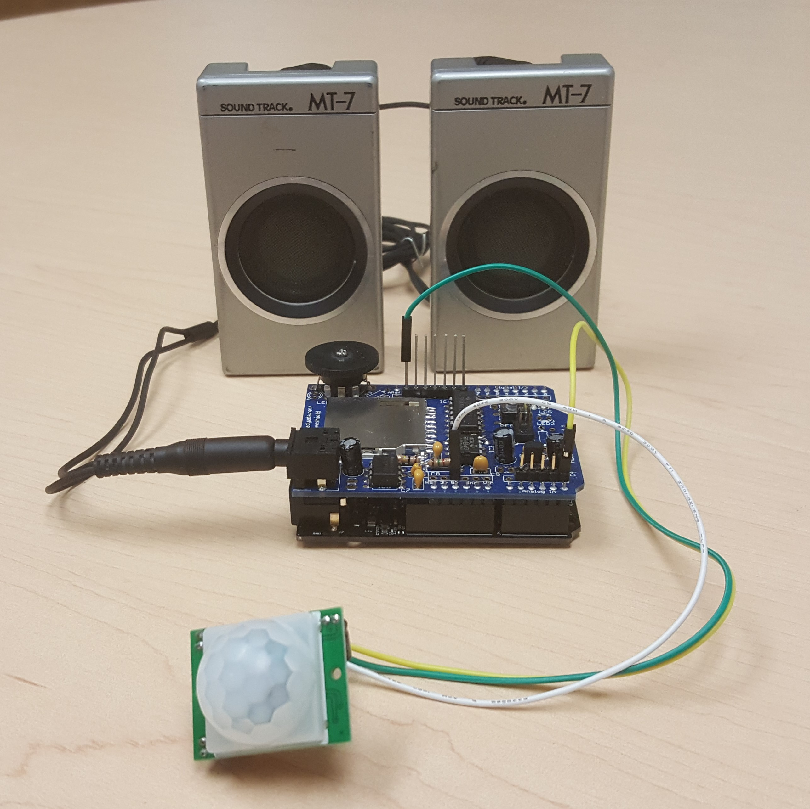

# HiFive Example Code
Example applications that run on a HiFive - SiFive's RISC-V-based, open-source, Arduino-compatible development board.
## Motion-Triggered Audio Message Player
Uses an Arduino wave shield, PIR motion sensor, and speakers to play an audio message when motion is detected.

